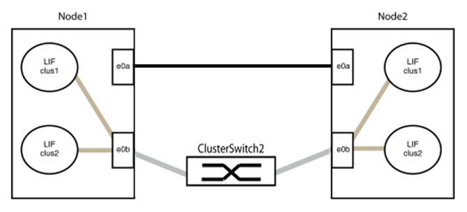

= 以直接連線取代交換器
:allow-uri-read: 
:icons: font
:imagesdir: ../media/

如果您有使用叢集互連交換器的雙節點叢集、請使用節點之間的直接後端對後端連線來更換交換器。這是不中斷營運的作業。

.開始之前
* 叢集必須健全、由兩個節點組成、並由叢集交換器連接、而且節點必須執行相同ONTAP 的版本資訊。
* 每個節點都必須具有所需數量的專用叢集連接埠、以提供備援叢集互連連連連線、以支援您的系統組態、例如每個節點上有兩個專用叢集互連連接埠的系統有兩個備援連接埠。

.關於這項工作
下列程序會移除雙節點叢集中的叢集交換器、並以直接連線至合作夥伴節點的方式取代與交換器的每個連線。

image::../media/tnsc_clusterswitches_and_direct_connections.PNG[叢集交換器已由直接連線取代]

下列程序中的範例顯示使用「e0a」和「e0b」做為叢集連接埠的節點。您的節點可能使用不同的叢集連接埠、因為它們會因系統而異。

.步驟
. 將權限等級變更為進階、並在系統提示您繼續時輸入「y」：
+
"進階權限"

+
出現進階提示「*>」。

. 支援自動偵測無交換器叢集的功能、預設為啟用。ONTAP
+
您可以執行進階權限命令、驗證是否已啟用無交換器叢集的偵測：

+
「網路選項偵測無交換器叢集顯示」

+
下列輸出範例顯示選項是否已啟用。

+
[listing]
----
cluster::*> network options detect-switchless-cluster show
   (network options detect-switchless-cluster show)
Enable Switchless Cluster Detection: true
----
+
如果「啟用無交換器叢集偵測」為「假」、請聯絡支援部門。

. 如果AutoSupport 此叢集啟用了「支援」功能、請叫用AutoSupport 下列訊息來禁止自動建立案例：
+
「系統節點AutoSupport 不完整地叫用節點*-type all -Message MAn=<number_of_hs>h」

+
其中「h」是指維護時段的持續時間、以小時為單位。此訊息會通知技術支援人員此維護工作、以便他們在維護期間隱藏自動建立個案。

+
在下列範例中、命令會禁止自動建立兩小時的個案：

+
[listing]
----
cluster::*> system node autosupport invoke -node * -type all -message MAINT=2h
----
. 將每個交換器上的叢集連接埠組織成群組、使群組1中的叢集連接埠移至叢集交換器1、而群組2中的叢集連接埠移至叢集交換器2。程序稍後會要求這些群組。
. 識別叢集連接埠、並驗證連結狀態和健全狀況：
+
「網路連接埠show -IPSpace Cluster」

+
在以下範例中、對於具有叢集連接埠「e0a」和「e0b」的節點、一個群組會識別為「node1:e0a」和「node2:e0a」、另一個群組則識別為「node1:e0b」和「node2:e0b」。您的節點可能使用不同的叢集連接埠、因為它們會因系統而異。

+
image::../media/tnsc_clusterswitch_connections.PNG[節點1和節點2之間的叢集交換器連線]

+
驗證連接埠的「Link」欄位值是否為「Up」、「Health Status」欄位值是否為「Healthy」、如下列範例所示：

+
[listing]
----
cluster::> network port show -ipspace Cluster
Node: node1
                                                                 Ignore
                                             Speed(Mbps) Health  Health
Port  IPspace   Broadcast Domain Link  MTU   Admin/Oper	 Status  Status
----- --------- ---------------- ----- ----- ----------- ------- -------
e0a   Cluster   Cluster          up    9000  auto/10000  healthy false
e0b   Cluster   Cluster          up    9000  auto/10000  healthy false

Node: node2
                                                                 Ignore
                                             Speed(Mbps) Health  Health
Port  IPspace   Broadcast Domain Link  MTU   Admin/Oper	 Status  Status
----- --------- ---------------- ----- ----- ----------- ------- -------
e0a   Cluster   Cluster          up    9000  auto/10000  healthy false
e0b   Cluster   Cluster          up    9000  auto/10000  healthy false
4 entries were displayed.
----
. 確認所有的叢集生命區都位於其主連接埠上。
+
驗證每個叢集生命體的「is主目錄」欄位是否為「true」：

+
「網路介面show -vserver叢集-Fields is主場」

+
系統會顯示類似下列範例的輸出：

+
[listing]
----
cluster::*> net int show -vserver Cluster -fields is-home
(network interface show)
vserver  lif          is-home
-------- ------------ --------
Cluster  node1_clus1  true
Cluster  node1_clus2  true
Cluster  node2_clus1  true
Cluster  node2_clus2  true
4 entries were displayed.
----
+
如果主連接埠上沒有叢集LIF、請將這些LIF還原至主連接埠：

+
「網路介面回復-vserver叢集-lIF *」

. 停用叢集生命體的自動還原：
+
「網路介面修改-vserver叢集-lIF *-auta-fRevert假」

. 驗證上一步驟中列出的所有連接埠都已連線至網路交換器：
+
「網路裝置探索show -port _cluster連接埠_」

+
「探索到的裝置」欄應為連接埠所連接的叢集交換器名稱。下列範例顯示叢集連接埠「e0a」和「e0b」已正確連接至叢集交換器「CS1」和「CS2」。

+
[listing]
----
cluster::> network device-discovery show -port e0a|e0b
  (network device-discovery show)
Node/     Local  Discovered
Protocol  Port   Device (LLDP: ChassisID)  Interface  Platform
--------- ------ ------------------------- ---------- ----------
node1/cdp
          e0a    cs1                       0/11       BES-53248
          e0b    cs2                       0/12       BES-53248
node2/cdp
          e0a    cs1                       0/9        BES-53248
          e0b    cs2                       0/9        BES-53248
4 entries were displayed.
----
. 驗證叢集連線能力：
+
「叢集ping叢集節點本機」

. 驗證叢集是否正常：
+
「叢集響鈴」

+
所有裝置必須為主裝置或次裝置。

. 設定群組1中連接埠的無交換器組態。
+

IMPORTANT: 為了避免潛在的網路問題、您必須從群組1中斷連接連接連接埠、並儘快將其重新連線至後端、例如*不到20秒*。

+
.. 同時從群組1的連接埠拔下所有纜線。
+
在下列範例中、纜線會從每個節點上的連接埠「e0a」中斷連線、而叢集流量會繼續透過交換器和每個節點上的連接埠「e0b」傳輸：

+
image::../media/tnsc_clusterswitch1_disconnected.PNG[ClusterSwitch1已中斷連線]

.. 將群組1中的連接埠從後端連接至後端。
+
在下列範例中、節點1上的「e0a」已連線至節點2上的「e0a」：

+

. 無交換式叢集網路選項從「假」轉換為「真」。這可能需要45秒的時間。確認無交換器選項設定為「true」：
+
「網路選項、無交換式叢集展示」

+
下列範例顯示無交換器叢集已啟用：

+
[listing]
----
cluster::*> network options switchless-cluster show
Enable Switchless Cluster: true
----
. 確認叢集網路未中斷：
+
「叢集ping叢集節點本機」

+

IMPORTANT: 在繼續下一步之前、您必須等待至少兩分鐘、以確認群組1的後端對後端連線正常運作。

. 設定群組2中連接埠的無交換器組態。
+

IMPORTANT: 為了避免潛在的網路問題、您必須從群組2中斷連接連接連接埠、並儘快將其重新連線至後端、例如*不到20秒*。

+
.. 同時從群組2的連接埠拔下所有纜線。
+
在下列範例中、纜線會從每個節點的連接埠「e0b」中斷連線、而叢集流量則會透過「e0a」連接埠之間的直接連線繼續傳輸：

+
image::../media/tnsc_clusterswitch2_disconnected.PNG[ClusterSwitch2已中斷連線]

.. 將群組2中的連接埠從後端連接至後端。
+
在下列範例中、節點1上的「e0a」連接至節點2上的「e0a」、節點1上的「e0b」連接至節點2上的「e0b」：

+
image::../media/tnsc_node1_and_node2_direct_connection.PNG[在節點1和節點2上的連接埠之間建立直接連線]

. 驗證兩個節點上的連接埠是否正確連接：
+
「網路裝置探索show -port _cluster連接埠_」

+
下列範例顯示叢集連接埠「e0a」和「e0b」已正確連接至叢集合作夥伴上的對應連接埠：

+
[listing]
----
cluster::> net device-discovery show -port e0a|e0b
  (network device-discovery show)
Node/      Local  Discovered
Protocol   Port   Device (LLDP: ChassisID)  Interface  Platform
---------- ------ ------------------------- ---------- ----------
node1/cdp
           e0a    node2                     e0a        AFF-A300
           e0b    node2                     e0b        AFF-A300
node1/lldp
           e0a    node2 (00:a0:98:da:16:44) e0a        -
           e0b    node2 (00:a0:98:da:16:44) e0b        -
node2/cdp
           e0a    node1                     e0a        AFF-A300
           e0b    node1                     e0b        AFF-A300
node2/lldp
           e0a    node1 (00:a0:98:da:87:49) e0a        -
           e0b    node1 (00:a0:98:da:87:49) e0b        -
8 entries were displayed.
----
. 重新啟用叢集生命體的自動還原：
+
「網路介面修改-vserver叢集-lif*-auta-f還原 為真」

. 確認所有生命都在家裡。這可能需要幾秒鐘的時間：
+
「網路介面show -vserver cluster -lif_lif_name_」

+
如果"is Home"（是主目錄）列是"true"（真），則已恢復生命，如以下範例中的"node1_clus2"和"node2_clus2"所示：

+
[listing]
----
cluster::> network interface show -vserver Cluster -fields curr-port,is-home
vserver  lif           curr-port is-home
-------- ------------- --------- -------
Cluster  node1_clus1   e0a       true
Cluster  node1_clus2   e0b       true
Cluster  node2_clus1   e0a       true
Cluster  node2_clus2   e0b       true
4 entries were displayed.
----
+
如果有任何叢集LIF尚未返回其主連接埠、請手動還原它們：

+
「網路介面回復-vserver叢集-lif_lif_name_'

. 從任一節點的系統主控台檢查節點的叢集狀態：
+
「叢集展示」

+
以下範例顯示兩個節點上的epsilon為「假」：

+
[listing]
----
Node  Health  Eligibility Epsilon
----- ------- ----------- --------
node1 true    true        false
node2 true    true        false
2 entries were displayed.
----
. 確認叢集連接埠之間的連線：
+
「叢集ping叢集本機」

. 如果您禁止自動建立個案、請叫用AutoSupport 下列消息來重新啟用此功能：
+
「系統節點AutoSupport 不完整地叫用節點*-type all -most MAn=end」

. 將權限層級變更回管理：
+
「et -priv. admin」

*相關資訊*

link:https://kb.netapp.com/Advice_and_Troubleshooting/Data_Storage_Software/ONTAP_OS/How_to_suppress_automatic_case_creation_during_scheduled_maintenance_windows_-_ONTAP_9["NetApp知識庫文件編號1010449：如何在排程的維護期間、抑制自動建立案例"^]
