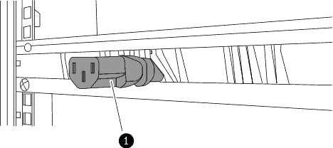
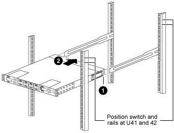

= 在NetApp機櫃中安裝Cisco Nexus 9336C-FX2交換器和直通面板
:allow-uri-read: 
:icons: font
:imagesdir: ../media/

[role="lead"]
您可以將Cisco Nexus 9336C-FX2交換器和直通面板安裝在NetApp機櫃中、並附有交換器隨附的標準支架。

您必須已檢閱初始準備要求、套件內容及安全預防措施。

https://www.cisco.com/c/en/us/td/docs/switches/datacenter/nexus9000/hw/aci_9336cfx2_hig/guide/b_n9336cFX2_aci_hardware_installation_guide.html["Cisco Nexus 9000系列硬體安裝指南"^]

* 對於每個交換器、您必須提供八個10-32或12-24個螺絲和固定夾螺帽、才能將托架和滑軌安裝到機箱前後的支柱上。
* 您必須使用Cisco標準軌道套件、將交換器安裝在NetApp機櫃中。

NOTE: 跳接線未隨附於傳遞套件中、應隨附於交換器中。如果交換器未隨附、您可以向NetApp訂購（零件編號X1558A-R6）。

.步驟
. 在NetApp機櫃中安裝直通遮罩面板。
+
NetApp提供直通面板套件（零件編號X8784-R6）。

+
NetApp傳遞面板套件包含下列硬體：

+
** 一個直通遮罩面板
** 四顆10-32 x .75螺絲
** 四個10-32扣具螺帽
+
... 確定交換器的垂直位置和機櫃中的遮板。
+
在此程序中、遮罩面板將安裝在U40中。

... 在機箱正面軌道的適當方孔中、每側安裝兩個固定螺帽。
... 將面板垂直置中、以防止侵入鄰近的機架空間、然後鎖緊螺絲。
... 將兩根48吋跳接線的母接頭從面板背面插入、並穿過筆刷組件。
+

+
.... 跳接線的母接頭。

. 在Nexus 9336C-FX2交換器機箱上安裝機架安裝支架。
+
.. 將正面機架安裝支架放在交換器機箱的一側、使安裝耳對齊機箱面板（PSU或風扇側）、然後使用四顆M4螺絲將支架連接至機箱。
+
image::../media/3132q_front_bracket.gif[前支架]

.. 重複步驟 <<SUBSTEP_9F2E2DDAEE084FE5853D1A6C6D945941,2A.>> 在交換器另一側安裝另一個正面機架安裝支架。
.. 在交換器機箱上安裝後機架安裝支架。
.. 重複步驟 <<SUBSTEP_53A502380D6D4F058F62ED5ED5FC2000,2C>> 在交換器另一側安裝另一個機架安裝支架。

. 將夾螺帽安裝在四個IEA柱的方孔位置。
+
image::../media/ru_locations_for_3132q_v.gif[用於3132q v的RU位置]

+
兩個9336C-FX2交換器一律安裝在機櫃RU41和42的最上方2U中。

. 在機箱中安裝滑軌。
+
.. 將第一個滑軌放在左後柱背面的RU42標記處、插入符合螺絲類型的螺絲、然後用手指鎖緊螺絲。
+
image::../media/3132q_v_slider_rails.gif[3132q v滑軌]

+
... 當您輕推滑桿滑軌時、請將滑軌對準機架上的螺絲孔。
... 將滑軌的螺絲鎖緊至機箱柱。

.. 重複步驟 <<SUBSTEP_81651316D3F84964A76BC80A9DE48C0E,4a>> 用於右後側POST。
.. 重複步驟 <<SUBSTEP_81651316D3F84964A76BC80A9DE48C0E,4a>> 和 <<SUBSTEP_593967A423024594B9A41A04703DC458,4B>> 位於機櫃上的RU41位置。

. 將交換器安裝在機櫃中。
+

NOTE: 此步驟需要兩個人：一個人從正面支援交換器、另一個人則引導交換器進入後滑軌。

+
.. 將交換器背面置於RU41。
+

+
... 將機箱推向後柱時、請將兩個後機架安裝導軌對齊滑軌。
... 輕推交換器、直到前機架安裝支架與前柱齊面。

.. 將交換器連接至機櫃。
+
image::../media/3132q_attaching.gif[3132q附加]

+
... 一個人拿著機箱前端、另一個人應將四顆後螺絲完全鎖緊至機箱柱。

.. 現在機箱無需協助即可支援、將前螺絲完全鎖緊至機箱柱。
.. 重複步驟 <<SUBSTEP_4F538C8C55E34C5FB5D348391088A0FE,5a.>> 透過 <<SUBSTEP_EB8FE2FED2CA4120B709CC753C0F50FC,5C>> 用於RU42位置的第二個交換器。
+

NOTE: 使用完全安裝的交換器作為支援、在安裝過程中不需要抓住第二個交換器的正面。

. 安裝交換器時、請將跳線連接至交換器電源插座。
. 將兩條跳線的公插塞連接至最近的可用PDU插座。
+

NOTE: 為了維持備援、必須將兩條線路連接至不同的PDU。

. 將每台9336C-FX2交換器上的管理連接埠連接至任一管理交換器（如有訂購）、或直接將其連接至管理網路。
+
管理連接埠是位於交換器PSU端的右上方連接埠。每個交換器的CAT6纜線必須在安裝交換器以連接到管理交換器或管理網路之後、透過傳遞面板進行佈線。

