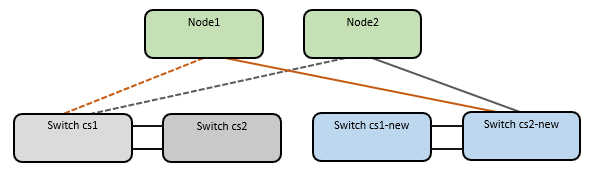

= 從老舊的Cisco交換器移轉至Cisco Nexus 9336C-FX2叢集交換器
:allow-uri-read: 
:icons: font
:imagesdir: ../media/

[role="lead"]
您可以從舊的Cisco叢集交換器執行不中斷營運的移轉、移轉至Cisco Nexus 9336C-FX2叢集網路交換器。

== 檢閱要求

確保：

* Nexus 9336C-FX2 交換器上的部分連接埠已設定為以 10GbE 或 40GbE 執行。
* 從節點到 Nexus 9336C-FX2 叢集交換器的 10GbE 與 40GbE 連線能力已規劃、移轉及記錄。
* 叢集運作正常（記錄中不應有錯誤或類似問題）。
* Cisco Nexus 9336C-FX2交換器的初始自訂已完成、因此：
+
** 9336C-FX2交換器正在執行最新建議版本的軟體。
** 參考組態檔（RCT）已套用至交換器。
** 任何站台自訂、例如DNS、NTP、SMTP、SNMP、和SSH、在新交換器上設定。

* 您可以存取上的交換器相容性表 https://mysupport.netapp.com/site/info/cisco-ethernet-switch["Cisco乙太網路交換器"^] 頁面、以取得支援ONTAP 的功能表、NX-OS和RCF版本。
* 您已檢閱Cisco網站上提供的適當軟體與升級指南、以瞭解Cisco交換器升級與降級程序、網址為 https://www.cisco.com/c/en/us/support/switches/nexus-9000-series-switches/series.html["Cisco Nexus 9000系列交換器支援"^] 頁面。

NOTE: 如果您要變更 AFF A800 或 AFF C800 系統上 e0a 和 e1a 叢集連接埠的連接埠速度、您可能會發現速度轉換後收到格式錯誤的封包。請參閱  https://mysupport.netapp.com/site/bugs-online/product/ONTAP/BURT/1570339["錯誤 1570339"^] 以及知識庫文章 https://kb.netapp.com/onprem/ontap/hardware/CRC_errors_on_T6_ports_after_converting_from_40GbE_to_100GbE["從 40GbE 轉換為 100GbE 後、 T6 連接埠發生 CRC 錯誤"^] 以取得指引。

== 移轉交換器

.關於範例
本程序中的範例使用兩個節點。這些節點使用兩個10GbE叢集互連連接埠e0a和e0b。請參閱 https://hwu.netapp.com/["Hardware Universe"^] 驗證平台上的叢集連接埠是否正確。

NOTE: 命令輸出可能會因ONTAP 不同版本的資訊而有所不同。

本程序中的範例使用下列交換器和節點命名法：

* 現有兩個Cisco交換器的名稱為* CS1*和* CS2*
* 新的Nexus 9336C-FX2叢集交換器為* CS1-new *和* CS2-new *。
* 節點名稱是* node1*和* node2*。
* 叢集LIF名稱為*節點1_clus1*、節點1為*節點1_clus2*、節點2為*節點2_clus1*、節點2為*節點2_clus2*。
* * cluster1：：*>*提示會指出叢集的名稱。

在此程序中、請參閱下列範例：

image::../media/Initial_setup.png[初始交換器設定]

.關於這項工作
此程序需要同時使用ONTAP 支援指令和 https://www.cisco.com/c/en/us/support/switches/nexus-9000-series-switches/series.html["Nexus 9000系列交換器"^] 命令；ONTAP 除非另有說明、否則會使用指令。

本程序涵蓋下列案例：

* 交換器 CS2 會先由交換器 CS2 取代 - 新的。
+
** 關閉連接至叢集節點的連接埠。必須同時關閉所有連接埠、以避免叢集不穩定。
** 然後、節點與 CS2 之間的纜線會從 CS2 中斷連線、並重新連線至 CS2-new 。

* 交換器 CS1 由交換器 CS1-new 取代。
+
** 關閉連接至叢集節點的連接埠。必須同時關閉所有連接埠、以避免叢集不穩定。
** 然後、節點與 CS1 之間的纜線會從 CS1 中斷連線、並重新連線至 CS1-new 。

NOTE: 在此程序期間、不需要運作中的交換器間連結（ISL）。這是因為RCF版本變更可能會暫時影響ISL連線。為確保叢集作業不中斷、下列程序會在目標交換器上執行步驟時、將所有叢集生命體移轉至作業夥伴交換器。

=== 步驟1：準備移轉

. 如果AutoSupport 此叢集啟用了「支援功能」、請叫用AutoSupport 「系統節點AutoSupport 支援功能叫用節點*-type all -most MAn=xh」訊息來禁止自動建立案例
+
其中_x_是維護時段的持續時間（以小時為單位）。

+

NOTE: 此資訊可通知技術支援人員執行此維護工作、以便在維護期間抑制自動建立案例。AutoSupport

. 將權限等級變更為進階、並在系統提示您繼續時輸入* y*：
+
"進階權限"

+
出現進階提示（*>）。

=== 步驟2：設定連接埠和纜線

. 在新交換器上、確認ISL已連接好、而且在CS1-new和CS2-new交換器之間正常運作：
+
「How port-channel Summary」

+
.顯示範例
[%collapsible]
====
[listing, subs="+quotes"]
----
cs1-new# *show port-channel summary*
Flags:  D - Down        P - Up in port-channel (members)
        I - Individual  H - Hot-standby (LACP only)
        s - Suspended   r - Module-removed
        b - BFD Session Wait
        S - Switched    R - Routed
        U - Up (port-channel)
        p - Up in delay-lacp mode (member)
        M - Not in use. Min-links not met
--------------------------------------------------------------------------------
Group Port-       Type     Protocol  Member Ports
      Channel
--------------------------------------------------------------------------------
1     Po1(SU)     Eth      LACP      Eth1/35(P)   Eth1/36(P)

cs2-new# *show port-channel summary*
Flags:  D - Down        P - Up in port-channel (members)
        I - Individual  H - Hot-standby (LACP only)
        s - Suspended   r - Module-removed
        b - BFD Session Wait
        S - Switched    R - Routed
        U - Up (port-channel)
        p - Up in delay-lacp mode (member)
        M - Not in use. Min-links not met
--------------------------------------------------------------------------------
Group Port-       Type     Protocol  Member Ports
      Channel
--------------------------------------------------------------------------------
1     Po1(SU)     Eth      LACP      Eth1/35(P)   Eth1/36(P)
----
====
. 顯示連接至現有叢集交換器之每個節點上的叢集連接埠：
+
「網路裝置探索秀」

+
.顯示範例
[%collapsible]
====
[listing, subs="+quotes"]
----
cluster1::*> *network device-discovery show -protocol cdp*
Node/       Local  Discovered
Protocol    Port   Device (LLDP: ChassisID)  Interface         Platform
----------- ------ ------------------------- ----------------  ----------------
node1      /cdp
            e0a    cs1                       Ethernet1/1        N5K-C5596UP
            e0b    cs2                       Ethernet1/2        N5K-C5596UP
node2      /cdp
            e0a    cs1                       Ethernet1/1        N5K-C5596UP
            e0b    cs2                       Ethernet1/2        N5K-C5596UP
----
====
. 確定每個叢集連接埠的管理或作業狀態。
+
.. 確認所有叢集連接埠都正常運作：
+
「網路連接埠show -IPSpace Cluster」

+
.顯示範例
[%collapsible]
====
[listing, subs="+quotes"]
----
cluster1::*> *network port show -ipspace Cluster*

Node: node1
                                                                       Ignore
                                                  Speed(Mbps) Health   Health
Port      IPspace      Broadcast Domain Link MTU  Admin/Oper  Status   Status
--------- ------------ ---------------- ---- ---- ----------- -------- ------
e0a       Cluster      Cluster          up   9000  auto/10000 healthy  false
e0b       Cluster      Cluster          up   9000  auto/10000 healthy  false

Node: node2
                                                                       Ignore
                                                  Speed(Mbps) Health   Health
Port      IPspace      Broadcast Domain Link MTU  Admin/Oper  Status   Status
--------- ------------ ---------------- ---- ---- ----------- -------- ------
e0a       Cluster      Cluster          up   9000  auto/10000 healthy  false
e0b       Cluster      Cluster          up   9000  auto/10000 healthy  false
----
====
.. 確認所有叢集介面（l生命）都位於其主連接埠上：
+
「網路介面show -vserver叢集」

+
.顯示範例
[%collapsible]
====
[listing, subs="+quotes"]
----
cluster1::*> *network interface show -vserver Cluster*

            Logical      Status     Network            Current     Current Is
Vserver     Interface    Admin/Oper Address/Mask       Node        Port    Home
----------- -----------  ---------- ------------------ ----------- ------- ----
Cluster
            node1_clus1  up/up      169.254.209.69/16  node1       e0a     true
            node1_clus2  up/up      169.254.49.125/16  node1       e0b     true
            node2_clus1  up/up      169.254.47.194/16  node2       e0a     true
            node2_clus2  up/up      169.254.19.183/16  node2       e0b     true
----
====
.. 驗證叢集是否顯示兩個叢集交換器的資訊：
+
「系統叢集交換器show -is監控、可運作的true」

+
.顯示範例
[%collapsible]
====
[listing, subs="+quotes"]
----
cluster1::*> *system cluster-switch show -is-monitoring-enabled-operational true*
Switch                      Type               Address          Model
--------------------------- ------------------ ---------------- ---------------
cs1                         cluster-network    10.233.205.92    N5K-C5596UP
      Serial Number: FOXXXXXXXGS
       Is Monitored: true
             Reason: None
   Software Version: Cisco Nexus Operating System (NX-OS) Software, Version
                     9.3(4)
     Version Source: CDP

cs2                         cluster-network     10.233.205.93   N5K-C5596UP
      Serial Number: FOXXXXXXXGD
       Is Monitored: true
             Reason: None
   Software Version: Cisco Nexus Operating System (NX-OS) Software, Version
                     9.3(4)
     Version Source: CDP
----
====

. 停用叢集生命體上的自動還原。
+
「網路介面修改-vserver叢集-lIF *-auta-fRevert假」

+

NOTE: 停用自動還原功能可確保 ONTAP 只在稍後關閉交換器連接埠時容錯移轉叢集生命體。

. 在叢集交換器 CS2 上、關閉連接到 * 所有 * 節點叢集連接埠的連接埠、以便容錯移轉叢集生命期：
+
[listing, subs="+quotes"]
----
cs2(config)# *interface eth1/1-1/2*
cs2(config-if-range)# *shutdown*
----
. 驗證叢集生命期是否已容錯移轉至叢集交換器 CS1 上所主控的連接埠。這可能需要幾秒鐘的時間。
+
「網路介面show -vserver叢集」

+
.顯示範例
[%collapsible]
====
[listing, subs="+quotes"]
----
cluster1::*> *network interface show -vserver Cluster*
            Logical       Status     Network            Current    Current Is
Vserver     Interface     Admin/Oper Address/Mask       Node       Port    Home
----------- ------------- ---------- ------------------ ---------- ------- ----
Cluster
            node1_clus1   up/up      169.254.3.4/16     node1      e0a     true
            node1_clus2   up/up      169.254.3.5/16     node1      e0a     false
            node2_clus1   up/up      169.254.3.8/16     node2      e0a     true
            node2_clus2   up/up      169.254.3.9/16     node2      e0a     false
----
====
. 驗證叢集是否正常：
+
「叢集展示」

+
.顯示範例
[%collapsible]
====
[listing, subs="+quotes"]
----
cluster1::*> cluster show
Node       Health  Eligibility   Epsilon
---------- ------- ------------- -------
node1      true    true          false
node2      true    true          false
----
====
. 將所有叢集節點連線纜線從舊版 CS2 交換器移至新的 CS2-new 交換器。
+
* 叢集節點連線纜線移至 CS2 新交換器 *

+

. 確認移至CS2-new的網路連線健全狀況：
+
「網路連接埠show -IPSpace Cluster」

+
.顯示範例
[%collapsible]
====
[listing, subs="+quotes"]
----
cluster1::*> *network port show -ipspace Cluster*

Node: node1
                                                                       Ignore
                                                  Speed(Mbps) Health   Health
Port      IPspace      Broadcast Domain Link MTU  Admin/Oper  Status   Status
--------- ------------ ---------------- ---- ---- ----------- -------- ------
e0a       Cluster      Cluster          up   9000  auto/10000 healthy  false
e0b       Cluster      Cluster          up   9000  auto/10000 healthy  false

Node: node2
                                                                       Ignore
                                                  Speed(Mbps) Health   Health
Port      IPspace      Broadcast Domain Link MTU  Admin/Oper  Status   Status
--------- ------------ ---------------- ---- ---- ----------- -------- ------
e0a       Cluster      Cluster          up   9000  auto/10000 healthy  false
e0b       Cluster      Cluster          up   9000  auto/10000 healthy  false
----
====
+
所有移除的叢集連接埠都應為上移。

. 檢查叢集連接埠上的鄰近資訊：
+
「network device-dDiscovery show -protocol cup」

+
.顯示範例
[%collapsible]
====
[listing, subs="+quotes"]
----
cluster1::*> *network device-discovery show -protocol cdp*

Node/       Local  Discovered
Protocol    Port   Device (LLDP: ChassisID)  Interface      Platform
----------- ------ ------------------------- -------------  --------------
node1      /cdp
            e0a    cs1                       Ethernet1/1    N5K-C5596UP
            e0b    cs2-new                   Ethernet1/1/1  N9K-C9336C-FX2

node2      /cdp
            e0a    cs1                       Ethernet1/2    N5K-C5596UP
            e0b    cs2-new                   Ethernet1/1/2  N9K-C9336C-FX2
----
====
+
驗證移動的叢集連接埠是否將CS2-new交換器視為鄰近端點。

. 從交換器 CS2-new's 的觀點來確認交換器連接埠連線：
+
[listing, subs="+quotes"]
----
cs2-new# *show interface brief*
cs2-new# *show cdp neighbors*
----
. 在叢集交換器 CS1 上、關閉連接到 * 所有 * 節點叢集連接埠的連接埠、以便容錯移轉叢集生命期。
+
[listing, subs="+quotes"]
----
cs1(config)# *interface eth1/1-1/2*
cs1(config-if-range)# *shutdown*
----
+
所有叢集生命體移轉至 CS2 新交換器。

. 確認叢集生命體已容錯移轉至交換器 CS2-new 上的主控連接埠。這可能需要幾秒鐘的時間：
+
「網路介面show -vserver叢集」

+
.顯示範例
[%collapsible]
====
[listing, subs="+quotes"]
----
cluster1::*> *network interface show -vserver Cluster*
            Logical      Status     Network            Current     Current Is
Vserver     Interfac     Admin/Oper Address/Mask       Node        Port    Home
----------- ------------ ---------- ------------------ ----------- ------- ----
Cluster
            node1_clus1  up/up      169.254.3.4/16     node1       e0b     false
            node1_clus2  up/up      169.254.3.5/16     node1       e0b     true
            node2_clus1  up/up      169.254.3.8/16     node2       e0b     false
            node2_clus2  up/up      169.254.3.9/16     node2       e0b     true
----
====
. 驗證叢集是否正常：
+
「叢集展示」

+
.顯示範例
[%collapsible]
====
[listing, subs="+quotes"]
----
cluster1::*> *cluster show*
Node       Health  Eligibility   Epsilon
---------- ------- ------------- -------
node1      true    true          false
node2      true    true          false
----
====
. 將叢集節點連線纜線從 CS1 移至新的 CS1-new 交換器。
+
* 叢集節點連線纜線移至 CS1-new switch*

+
image::../media/new_switch_cs2.png[叢集節點連線纜線移至 CS1-new 交換器]

. 確認移至CS1-new的網路連線健全狀況：
+
「網路連接埠show -IPSpace Cluster」

+
.顯示範例
[%collapsible]
====
[listing, subs="+quotes"]
----
cluster1::*> *network port show -ipspace Cluster*

Node: node1
                                                                       Ignore
                                                  Speed(Mbps) Health   Health
Port      IPspace      Broadcast Domain Link MTU  Admin/Oper  Status   Status
--------- ------------ ---------------- ---- ---- ----------- -------- ------
e0a       Cluster      Cluster          up   9000  auto/10000 healthy  false
e0b       Cluster      Cluster          up   9000  auto/10000 healthy  false

Node: node2
                                                                       Ignore
                                                  Speed(Mbps) Health   Health
Port      IPspace      Broadcast Domain Link MTU  Admin/Oper  Status   Status
--------- ------------ ---------------- ---- ---- ----------- -------- ------
e0a       Cluster      Cluster          up   9000  auto/10000 healthy  false
e0b       Cluster      Cluster          up   9000  auto/10000 healthy  false
----
====
+
所有移除的叢集連接埠都應為上移。

. 檢查叢集連接埠上的鄰近資訊：
+
「網路裝置探索秀」

+
.顯示範例
[%collapsible]
====
[listing, subs="+quotes"]
----
cluster1::*> *network device-discovery show -protocol cdp*
Node/       Local  Discovered
Protocol    Port   Device (LLDP: ChassisID)  Interface       Platform
----------- ------ ------------------------- --------------  --------------
node1      /cdp
            e0a    cs1-new                   Ethernet1/1/1   N9K-C9336C-FX2
            e0b    cs2-new                   Ethernet1/1/2   N9K-C9336C-FX2

node2      /cdp
            e0a    cs1-new                   Ethernet1/1/1   N9K-C9336C-FX2
            e0b    cs2-new                   Ethernet1/1/2   N9K-C9336C-FX2
----
====
+
驗證移動的叢集連接埠是否將CS1-new交換器視為鄰近端點。

. 從交換器 CS1-new's 的觀點來確認交換器連接埠連線：
+
[listing, subs="+quotes"]
----
cs1-new# *show interface brief*
cs1-new# *show cdp neighbors*
----
. 確認CS1-new與CS2-new之間的ISL仍可正常運作：
+
「How port-channel Summary」

+
.顯示範例
[%collapsible]
====
[listing, subs="+quotes"]
----
cs1-new# *show port-channel summary*
Flags:  D - Down        P - Up in port-channel (members)
        I - Individual  H - Hot-standby (LACP only)
        s - Suspended   r - Module-removed
        b - BFD Session Wait
        S - Switched    R - Routed
        U - Up (port-channel)
        p - Up in delay-lacp mode (member)
        M - Not in use. Min-links not met
--------------------------------------------------------------------------------
Group Port-       Type     Protocol  Member Ports
      Channel
--------------------------------------------------------------------------------
1     Po1(SU)     Eth      LACP      Eth1/35(P)   Eth1/36(P)

cs2-new# *show port-channel summary*
Flags:  D - Down        P - Up in port-channel (members)
        I - Individual  H - Hot-standby (LACP only)
        s - Suspended   r - Module-removed
        b - BFD Session Wait
        S - Switched    R - Routed
        U - Up (port-channel)
        p - Up in delay-lacp mode (member)
        M - Not in use. Min-links not met
--------------------------------------------------------------------------------
Group Port-       Type     Protocol  Member Ports
      Channel
--------------------------------------------------------------------------------
1     Po1(SU)     Eth      LACP      Eth1/35(P)   Eth1/36(P)
----
====

=== 步驟3：驗證組態

. 在叢集生命體上啟用自動還原。
+
「網路介面修改-vserver叢集-lif*-auta-f還原 為真」

. 驗證叢集生命區是否已還原至其主連接埠（這可能需要一分鐘時間）：
+
「網路介面show -vserver叢集」

+
如果叢集l生命 尚未還原至其主連接埠、請手動還原它們：

+
「網路介面回復-vserver叢集-lIF *」

. 驗證叢集是否正常：
+
「叢集展示」

. 驗證遠端叢集介面的連線能力：

[role="tabbed-block"]
====
.更新版本ONTAP
--
您可以使用 `network interface check cluster-connectivity` 命令以啟動叢集連線的存取檢查、然後顯示詳細資料：

`network interface check cluster-connectivity start` 和 `network interface check cluster-connectivity show`

[listing, subs="+quotes"]
----
cluster1::*> *network interface check cluster-connectivity start*
----
* 注意： * 在執行 show 命令之前、請等待數秒以顯示詳細資料。

[listing, subs="+quotes"]
----
cluster1::*> *network interface check cluster-connectivity show*
                                  Source          Destination       Packet
Node   Date                       LIF             LIF               Loss
------ -------------------------- --------------- ----------------- -----------
node1
       3/5/2022 19:21:18 -06:00   node1_clus2      node2_clus1      none
       3/5/2022 19:21:20 -06:00   node1_clus2      node2_clus2      none

node2
       3/5/2022 19:21:18 -06:00   node2_clus2      node1_clus1      none
       3/5/2022 19:21:20 -06:00   node2_clus2      node1_clus2      none
----
--
.所有 ONTAP 版本
--
對於所有 ONTAP 版本、您也可以使用 `cluster ping-cluster -node <name>` 檢查連線能力的命令：

`cluster ping-cluster -node <name>`

[listing, subs="+quotes"]
----
cluster1::*> *cluster ping-cluster -node node2*
Host is node2
Getting addresses from network interface table...
Cluster node1_clus1 169.254.209.69 node1     e0a
Cluster node1_clus2 169.254.49.125 node1     e0b
Cluster node2_clus1 169.254.47.194 node2     e0a
Cluster node2_clus2 169.254.19.183 node2     e0b
Local = 169.254.47.194 169.254.19.183
Remote = 169.254.209.69 169.254.49.125
Cluster Vserver Id = 4294967293
Ping status:
....
Basic connectivity succeeds on 4 path(s)
Basic connectivity fails on 0 path(s)
................
Detected 9000 byte MTU on 4 path(s):
    Local 169.254.19.183 to Remote 169.254.209.69
    Local 169.254.19.183 to Remote 169.254.49.125
    Local 169.254.47.194 to Remote 169.254.209.69
    Local 169.254.47.194 to Remote 169.254.49.125
Larger than PMTU communication succeeds on 4 path(s)
RPC status:
2 paths up, 0 paths down (tcp check)
2 paths up, 0 paths down (udp check)
----
--
====
. [[step5]] 啟用乙太網路交換器健全狀況監視器記錄收集功能、以收集交換器相關的記錄檔。

[role="tabbed-block"]
====
.更新版本ONTAP
--
使用下列兩個命令啟用乙太網路交換器健全狀況監視器記錄收集功能、以收集交換器相關的記錄檔：「System Switch Ethernet log setup-password」（系統交換器乙太網路記錄啟用-收集）和「System Switch Ethernet log enable - collection」（系統交換器乙太網路記錄啟用-收集）

*注意：*您需要交換器上*管理*使用者的密碼。

輸入：「System交換器乙太網路記錄設定密碼」

[listing, subs="+quotes"]
----
cluster1::*> *system switch ethernet log setup-password*
Enter the switch name: <return>
The switch name entered is not recognized.
Choose from the following list:
cs1-new
cs2-new

cluster1::*> *system switch ethernet log setup-password*

Enter the switch name: *cs1-new*
RSA key fingerprint is e5:8b:c6:dc:e2:18:18:09:36:63:d9:63:dd:03:d9:cc
Do you want to continue? {y|n}::[n] *y*

Enter the password: <password of switch's admin user>
Enter the password again: <password of switch's admin user>

cluster1::*> *system switch ethernet log setup-password*

Enter the switch name: *cs2-new*
RSA key fingerprint is 57:49:86:a1:b9:80:6a:61:9a:86:8e:3c:e3:b7:1f:b1
Do you want to continue? {y|n}:: [n] *y*

Enter the password: <password of switch's admin user>
Enter the password again: <password of switch's admin user>
----
接著是：「系統交換器乙太網路記錄啟用-收集」

[listing, subs="+quotes"]
----
cluster1::*> *system  switch ethernet log enable-collection*

Do you want to enable cluster log collection for all nodes in the cluster?
{y|n}: [n] *y*

Enabling cluster switch log collection.

cluster1::*>
----
*附註：*如果上述任何命令傳回錯誤、請聯絡NetApp支援部門。

--
.發行9.5P16、9.6P12及9.7P10及更新版本的修補程式ONTAP
--
使用「系統叢集-交換器記錄設定密碼」和「系統叢集-交換器記錄啟用-收集」命令、啟用乙太網路交換器健全狀況監視器記錄收集功能以收集交換器相關的記錄檔

*注意：*您需要交換器上*管理*使用者的密碼。

輸入：「ystem叢集交換器記錄設定密碼」

[listing, subs="+quotes"]
----
cluster1::*> *system cluster-switch log setup-password*
Enter the switch name: <return>
The switch name entered is not recognized.
Choose from the following list:
cs1-new
cs2-new

cluster1::*> *system cluster-switch log setup-password*

Enter the switch name: *cs1-new*
RSA key fingerprint is e5:8b:c6:dc:e2:18:18:09:36:63:d9:63:dd:03:d9:cc
Do you want to continue? {y|n}::[n] *y*

Enter the password: <password of switch's admin user>
Enter the password again: <password of switch's admin user>

cluster1::*> *system cluster-switch log setup-password*

Enter the switch name: *cs2-new*
RSA key fingerprint is 57:49:86:a1:b9:80:6a:61:9a:86:8e:3c:e3:b7:1f:b1
Do you want to continue? {y|n}:: [n] *y*

Enter the password: <password of switch's admin user>
Enter the password again: <password of switch's admin user>
----
接著是：「系統叢集交換器記錄啟用-收集」

[listing, subs="+quotes"]
----
cluster1::*> *system cluster-switch log enable-collection*

Do you want to enable cluster log collection for all nodes in the cluster?
{y|n}: [n] *y*

Enabling cluster switch log collection.

cluster1::*>
----
*附註：*如果上述任何命令傳回錯誤、請聯絡NetApp支援部門。

--
====
. [[step6]] 如果您禁止自動建立個案、請叫用 AutoSupport 訊息來重新啟用： `system node autosupport invoke -node * -type all -message MAINT=END`

