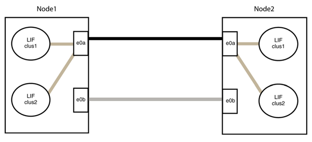

= 以無交換器連線取代NVIDIA SN2100叢集交換器
:allow-uri-read: 
:icons: font
:imagesdir: ../media/

[role="lead"]
您可以從具有交換式叢集網路的叢集移轉至兩個節點直接連線的叢集ONTAP 、以供支援使用於更新版本的版本。

== 檢閱要求

.準則
請檢閱下列準則：

* 移轉至雙節點無交換式叢集組態是不中斷營運的作業。大多數系統在每個節點上都有兩個專屬的叢集互連連接埠、但您也可以將此程序用於每個節點上具有大量專屬叢集互連連接埠的系統、例如四個、六個或八個。
* 您無法將無交換器式叢集互連功能用於兩個以上的節點。
* 如果您現有的雙節點叢集使用叢集互連交換器、而且執行ONTAP 的是更新版本的版本、您可以使用節點之間的直接後端對後端連線來取代交換器。

.開始之前
請確定您擁有下列項目：

* 健全的叢集、由叢集交換器連接的兩個節點組成。節點必須執行相同ONTAP 的發行版。
* 每個節點都有所需數量的專用叢集連接埠、可提供備援叢集互連連連連線來支援您的系統組態。例如、每個系統有兩個備援連接埠、每個節點上有兩個專屬的叢集互連連接埠。

== 移轉交換器

.關於這項工作
下列程序會移除雙節點叢集中的叢集交換器、並以直接連線至合作夥伴節點的方式取代與交換器的每個連線。

image::../media/tnsc_clusterswitches_and_direct_connections.PNG[叢集交換器已由直接連線取代]

.關於範例
下列程序中的範例顯示使用「e0a」和「e0b」做為叢集連接埠的節點。您的節點可能使用不同的叢集連接埠、因為它們會因系統而異。

=== 步驟1：準備移轉

. 將權限等級變更為進階、並在系統提示您繼續時輸入「y」：
+
"進階權限"

+
出現進階提示「*>」。

. 支援自動偵測無交換器叢集的功能、預設為啟用。ONTAP
+
您可以執行進階權限命令、驗證是否已啟用無交換器叢集的偵測：

+
「網路選項偵測無交換器叢集顯示」

+
.顯示範例
[%collapsible]
====
下列輸出範例顯示選項是否已啟用。

[listing]
----
cluster::*> network options detect-switchless-cluster show
   (network options detect-switchless-cluster show)
Enable Switchless Cluster Detection: true
----
====
+
如果「Enable Switchless Cluster Detection（啟用無交換器叢集偵測）」為 `false`請聯絡NetApp支援部門。

. 如果AutoSupport 此叢集啟用了「支援」功能、請叫用AutoSupport 下列訊息來禁止自動建立案例：
+
「系統節點AutoSupport 不完整地叫用節點*-type all -Message MAn=<number_of_hs>h」

+
其中「h」是指維護時段的持續時間、以小時為單位。此訊息會通知技術支援人員此維護工作、以便他們在維護期間隱藏自動建立個案。

+
在下列範例中、命令會禁止自動建立兩小時的個案：

+
.顯示範例
[%collapsible]
====
[listing]
----
cluster::*> system node autosupport invoke -node * -type all -message MAINT=2h
----
====

=== 步驟2：設定連接埠和纜線

. 將每個交換器上的叢集連接埠組織成群組、使群組1中的叢集連接埠移至叢集交換器1、而群組2中的叢集連接埠移至叢集交換器2。程序稍後會要求這些群組。
. 識別叢集連接埠、並驗證連結狀態和健全狀況：
+
「網路連接埠show -IPSpace Cluster」

+
在以下範例中、對於具有叢集連接埠「e0a」和「e0b」的節點、一個群組會識別為「node1:e0a」和「node2:e0a」、另一個群組則識別為「node1:e0b」和「node2:e0b」。您的節點可能使用不同的叢集連接埠、因為它們會因系統而異。

+
image::../media/tnsc_clusterswitch_connections.PNG[節點1和節點2之間的叢集交換器連線]

+
確認連接埠的值為 `up` 的「連結」欄和值 `healthy` 顯示「Health Status（健全狀況狀態）」欄。

+
.顯示範例
[%collapsible]
====
[listing]
----
cluster::> network port show -ipspace Cluster
Node: node1
                                                                 Ignore
                                             Speed(Mbps) Health  Health
Port  IPspace   Broadcast Domain Link  MTU   Admin/Oper	 Status  Status
----- --------- ---------------- ----- ----- ----------- ------- -------
e0a   Cluster   Cluster          up    9000  auto/10000  healthy false
e0b   Cluster   Cluster          up    9000  auto/10000  healthy false

Node: node2
                                                                 Ignore
                                             Speed(Mbps) Health  Health
Port  IPspace   Broadcast Domain Link  MTU   Admin/Oper	 Status  Status
----- --------- ---------------- ----- ----- ----------- ------- -------
e0a   Cluster   Cluster          up    9000  auto/10000  healthy false
e0b   Cluster   Cluster          up    9000  auto/10000  healthy false
4 entries were displayed.
----
====
. 確認所有的叢集生命區都位於其主連接埠上。
+
驗證每個叢集生命體的「is主目錄」欄位是否為「true」：

+
「網路介面show -vserver叢集-Fields is主場」

+
.顯示範例
[%collapsible]
====
[listing]
----
cluster::*> net int show -vserver Cluster -fields is-home
(network interface show)
vserver  lif          is-home
-------- ------------ --------
Cluster  node1_clus1  true
Cluster  node1_clus2  true
Cluster  node2_clus1  true
Cluster  node2_clus2  true
4 entries were displayed.
----
====
+
如果主連接埠上沒有叢集LIF、請將這些LIF還原至主連接埠：

+
「網路介面回復-vserver叢集-lIF *」

. 停用叢集生命體的自動還原：
+
「網路介面修改-vserver叢集-lIF *-auta-fRevert假」

. 驗證上一步驟中列出的所有連接埠都已連線至網路交換器：
+
「網路裝置探索show -port _cluster連接埠_」

+
「探索到的裝置」欄應為連接埠所連接的叢集交換器名稱。

+
.顯示範例
[%collapsible]
====
下列範例顯示叢集連接埠「e0a」和「e0b」已正確連接至叢集交換器「CS1」和「CS2」。

[listing]
----
cluster::> network device-discovery show -port e0a|e0b
  (network device-discovery show)
Node/     Local  Discovered
Protocol  Port   Device (LLDP: ChassisID)  Interface  Platform
--------- ------ ------------------------- ---------- ----------
node1/cdp
          e0a    cs1                       0/11       BES-53248
          e0b    cs2                       0/12       BES-53248
node2/cdp
          e0a    cs1                       0/9        BES-53248
          e0b    cs2                       0/9        BES-53248
4 entries were displayed.
----
====
. 驗證遠端叢集介面的連線能力：

[role="tabbed-block"]
====
.更新版本ONTAP
--
您可以使用 `network interface check cluster-connectivity` 命令以啟動叢集連線的存取檢查、然後顯示詳細資料：

`network interface check cluster-connectivity start` 和 `network interface check cluster-connectivity show`

[listing, subs="+quotes"]
----
cluster1::*> *network interface check cluster-connectivity start*
----
* 注意： * 請等待數秒後再執行 `show`命令以顯示詳細資料。

[listing, subs="+quotes"]
----
cluster1::*> *network interface check cluster-connectivity show*
                                  Source           Destination      Packet
Node   Date                       LIF              LIF              Loss
------ -------------------------- ---------------- ---------------- -----------
node1
       3/5/2022 19:21:18 -06:00   node1_clus2      node2-clus1      none
       3/5/2022 19:21:20 -06:00   node1_clus2      node2_clus2      none
node2
       3/5/2022 19:21:18 -06:00   node2_clus2      node1_clus1      none
       3/5/2022 19:21:20 -06:00   node2_clus2      node1_clus2      none
----
--
.所有 ONTAP 版本
--
對於所有 ONTAP 版本、您也可以使用 `cluster ping-cluster -node <name>` 檢查連線能力的命令：

`cluster ping-cluster -node <name>`

[listing, subs="+quotes"]
----
cluster1::*> *cluster ping-cluster -node local*
Host is node2
Getting addresses from network interface table...
Cluster node1_clus1 169.254.209.69 node1 e0a
Cluster node1_clus2 169.254.49.125 node1 e0b
Cluster node2_clus1 169.254.47.194 node2 e0a
Cluster node2_clus2 169.254.19.183 node2 e0b
Local = 169.254.47.194 169.254.19.183
Remote = 169.254.209.69 169.254.49.125
Cluster Vserver Id = 4294967293
Ping status:

Basic connectivity succeeds on 4 path(s)
Basic connectivity fails on 0 path(s)

Detected 9000 byte MTU on 4 path(s):
Local 169.254.47.194 to Remote 169.254.209.69
Local 169.254.47.194 to Remote 169.254.49.125
Local 169.254.19.183 to Remote 169.254.209.69
Local 169.254.19.183 to Remote 169.254.49.125
Larger than PMTU communication succeeds on 4 path(s)
RPC status:
2 paths up, 0 paths down (tcp check)
2 paths up, 0 paths down (udp check)
----
--
====
. [[step7]] 驗證叢集是否正常：
+
「叢集響鈴」

+
所有裝置必須為主裝置或次裝置。

. 設定群組1中連接埠的無交換器組態。
+

IMPORTANT: 為了避免潛在的網路問題、您必須從群組1中斷連接連接連接埠、並儘快將其重新連線至後端、例如*不到20秒*。

+
.. 同時從群組1的連接埠拔下所有纜線。
+
在下列範例中、纜線會從每個節點上的連接埠「e0a」中斷連線、而叢集流量會繼續透過交換器和每個節點上的連接埠「e0b」傳輸：

+
image::../media/tnsc_clusterswitch1_disconnected.PNG[ClusterSwitch1已中斷連線]

.. 將群組1中的連接埠從後端連接至後端。
+
在下列範例中、節點1上的「e0a」已連線至節點2上的「e0a」：

+
image::../media/tnsc_ports_e0a_direct_connection.PNG[連接埠「e0a」之間的直接連線]

. 無交換式叢集網路選項從「假」轉換為「真」。這可能需要45秒的時間。確認無交換器選項設定為「true」：
+
「網路選項、無交換式叢集展示」

+
下列範例顯示無交換器叢集已啟用：

+
[listing]
----
cluster::*> network options switchless-cluster show
Enable Switchless Cluster: true
----
. 驗證遠端叢集介面的連線能力：

[role="tabbed-block"]
====
.更新版本ONTAP
--
您可以使用 `network interface check cluster-connectivity` 命令以啟動叢集連線的存取檢查、然後顯示詳細資料：

`network interface check cluster-connectivity start` 和 `network interface check cluster-connectivity show`

[listing, subs="+quotes"]
----
cluster1::*> *network interface check cluster-connectivity start*
----
* 注意： * 請等待數秒後再執行 `show`命令以顯示詳細資料。

[listing, subs="+quotes"]
----
cluster1::*> *network interface check cluster-connectivity show*
                                  Source           Destination      Packet
Node   Date                       LIF              LIF              Loss
------ -------------------------- ---------------- ---------------- -----------
node1
       3/5/2022 19:21:18 -06:00   node1_clus2      node2-clus1      none
       3/5/2022 19:21:20 -06:00   node1_clus2      node2_clus2      none
node2
       3/5/2022 19:21:18 -06:00   node2_clus2      node1_clus1      none
       3/5/2022 19:21:20 -06:00   node2_clus2      node1_clus2      none
----
--
.所有 ONTAP 版本
--
對於所有 ONTAP 版本、您也可以使用 `cluster ping-cluster -node <name>` 檢查連線能力的命令：

`cluster ping-cluster -node <name>`

[listing, subs="+quotes"]
----
cluster1::*> *cluster ping-cluster -node local*
Host is node2
Getting addresses from network interface table...
Cluster node1_clus1 169.254.209.69 node1 e0a
Cluster node1_clus2 169.254.49.125 node1 e0b
Cluster node2_clus1 169.254.47.194 node2 e0a
Cluster node2_clus2 169.254.19.183 node2 e0b
Local = 169.254.47.194 169.254.19.183
Remote = 169.254.209.69 169.254.49.125
Cluster Vserver Id = 4294967293
Ping status:

Basic connectivity succeeds on 4 path(s)
Basic connectivity fails on 0 path(s)

Detected 9000 byte MTU on 4 path(s):
Local 169.254.47.194 to Remote 169.254.209.69
Local 169.254.47.194 to Remote 169.254.49.125
Local 169.254.19.183 to Remote 169.254.209.69
Local 169.254.19.183 to Remote 169.254.49.125
Larger than PMTU communication succeeds on 4 path(s)
RPC status:
2 paths up, 0 paths down (tcp check)
2 paths up, 0 paths down (udp check)
----
--
====

IMPORTANT: 在繼續下一步之前、您必須等待至少兩分鐘、以確認群組1的後端對後端連線正常運作。

. [[step11]] 為群組 2 中的連接埠設定無交換器組態。
+

IMPORTANT: 為了避免潛在的網路問題、您必須從群組2中斷連接連接連接埠、並儘快將其重新連線至後端、例如*不到20秒*。

+
.. 同時從群組2的連接埠拔下所有纜線。
+
在下列範例中、纜線會從每個節點的連接埠「e0b」中斷連線、而叢集流量則會透過「e0a」連接埠之間的直接連線繼續傳輸：

+
image::../media/tnsc_clusterswitch2_disconnected.PNG[ClusterSwitch2已中斷連線]

.. 將群組2中的連接埠從後端連接至後端。
+
在下列範例中、節點1上的「e0a」連接至節點2上的「e0a」、節點1上的「e0b」連接至節點2上的「e0b」：

+

=== 步驟3：驗證組態

. 驗證兩個節點上的連接埠是否正確連接：
+
「網路裝置探索show -port _cluster連接埠_」

+
.顯示範例
[%collapsible]
====
下列範例顯示叢集連接埠「e0a」和「e0b」已正確連接至叢集合作夥伴上的對應連接埠：

[listing]
----
cluster::> net device-discovery show -port e0a|e0b
  (network device-discovery show)
Node/      Local  Discovered
Protocol   Port   Device (LLDP: ChassisID)  Interface  Platform
---------- ------ ------------------------- ---------- ----------
node1/cdp
           e0a    node2                     e0a        AFF-A300
           e0b    node2                     e0b        AFF-A300
node1/lldp
           e0a    node2 (00:a0:98:da:16:44) e0a        -
           e0b    node2 (00:a0:98:da:16:44) e0b        -
node2/cdp
           e0a    node1                     e0a        AFF-A300
           e0b    node1                     e0b        AFF-A300
node2/lldp
           e0a    node1 (00:a0:98:da:87:49) e0a        -
           e0b    node1 (00:a0:98:da:87:49) e0b        -
8 entries were displayed.
----
====
. 重新啟用叢集生命體的自動還原：
+
「網路介面修改-vserver叢集-lif*-auta-f還原 為真」

. 確認所有生命都在家裡。這可能需要幾秒鐘的時間。
+
「網路介面show -vserver cluster -lif_lif_name_」

+
.顯示範例
[%collapsible]
====
如果"is Home"（是主目錄）列是"true"（真），則已恢復生命，如以下範例中的"node1_clus2"和"node2_clus2"所示：

[listing]
----
cluster::> network interface show -vserver Cluster -fields curr-port,is-home
vserver  lif           curr-port is-home
-------- ------------- --------- -------
Cluster  node1_clus1   e0a       true
Cluster  node1_clus2   e0b       true
Cluster  node2_clus1   e0a       true
Cluster  node2_clus2   e0b       true
4 entries were displayed.
----
====
+
如果有任何叢集生命期尚未返回其主連接埠、請從本機節點手動還原：

+
「網路介面回復-vserver叢集-lif_lif_name_'

. 從任一節點的系統主控台檢查節點的叢集狀態：
+
「叢集展示」

+
.顯示範例
[%collapsible]
====
以下範例顯示兩個節點上的epsilon為「假」：

[listing]
----
Node  Health  Eligibility Epsilon
----- ------- ----------- --------
node1 true    true        false
node2 true    true        false
2 entries were displayed.
----
====
. 驗證遠端叢集介面的連線能力：

[role="tabbed-block"]
====
.更新版本ONTAP
--
您可以使用 `network interface check cluster-connectivity` 命令以啟動叢集連線的存取檢查、然後顯示詳細資料：

`network interface check cluster-connectivity start` 和 `network interface check cluster-connectivity show`

[listing, subs="+quotes"]
----
cluster1::*> *network interface check cluster-connectivity start*
----
* 注意： * 請等待數秒後再執行 `show`命令以顯示詳細資料。

[listing, subs="+quotes"]
----
cluster1::*> *network interface check cluster-connectivity show*
                                  Source           Destination      Packet
Node   Date                       LIF              LIF              Loss
------ -------------------------- ---------------- ---------------- -----------
node1
       3/5/2022 19:21:18 -06:00   node1_clus2      node2-clus1      none
       3/5/2022 19:21:20 -06:00   node1_clus2      node2_clus2      none
node2
       3/5/2022 19:21:18 -06:00   node2_clus2      node1_clus1      none
       3/5/2022 19:21:20 -06:00   node2_clus2      node1_clus2      none
----
--
.所有 ONTAP 版本
--
對於所有 ONTAP 版本、您也可以使用 `cluster ping-cluster -node <name>` 檢查連線能力的命令：

`cluster ping-cluster -node <name>`

[listing, subs="+quotes"]
----
cluster1::*> *cluster ping-cluster -node local*
Host is node2
Getting addresses from network interface table...
Cluster node1_clus1 169.254.209.69 node1 e0a
Cluster node1_clus2 169.254.49.125 node1 e0b
Cluster node2_clus1 169.254.47.194 node2 e0a
Cluster node2_clus2 169.254.19.183 node2 e0b
Local = 169.254.47.194 169.254.19.183
Remote = 169.254.209.69 169.254.49.125
Cluster Vserver Id = 4294967293
Ping status:

Basic connectivity succeeds on 4 path(s)
Basic connectivity fails on 0 path(s)

Detected 9000 byte MTU on 4 path(s):
Local 169.254.47.194 to Remote 169.254.209.69
Local 169.254.47.194 to Remote 169.254.49.125
Local 169.254.19.183 to Remote 169.254.209.69
Local 169.254.19.183 to Remote 169.254.49.125
Larger than PMTU communication succeeds on 4 path(s)
RPC status:
2 paths up, 0 paths down (tcp check)
2 paths up, 0 paths down (udp check)
----
--
====
. [[step6]] 如果您禁止自動建立個案、請叫用 AutoSupport 訊息來重新啟用：
+
「系統節點AutoSupport 不完整地叫用節點*-type all -most MAn=end」

+
如需詳細資訊、請參閱 link:https://kb.netapp.com/Advice_and_Troubleshooting/Data_Storage_Software/ONTAP_OS/How_to_suppress_automatic_case_creation_during_scheduled_maintenance_windows_-_ONTAP_9["NetApp知識庫文件編號1010449：如何在排程的維護期間、抑制自動建立案例"^]。

. 將權限層級變更回管理：
+
「et -priv. admin」

